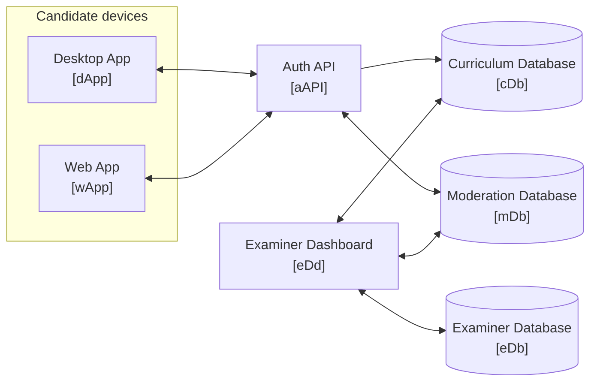

## Architecture

| Application | Responsibility                                                                                                                                                                |
| ----------- | ----------------------------------------------------------------------------------------------------------------------------------------------------------------------------- |
| **dApp**    | Serves exam content to the candidate and observes the station.                                                                                                                |
| **wApp**    | Entrypoint for candidates to create accounts, verify identity, view certifications, and register for exams. Captures biometrics, and can operate as second proctoring device. |
| **aAPI**    | Owns candidate identity and the attempt path. The only application candidate devices reach. Reads content through cDb; writes attempts and evidence to mDb.                   |
| **cDb**     | Exam content and its whole history. Self-hosted Dolt.                                                                                                                         |
| **mDb**     | Candidate identity, attempts, responses, and evidence. All candidate data.                                                                                                    |
| **eDd**     | Where examiners author, review, promote, and moderate. Owns examiner identity, roles, and scopes. This is both a server and web-app.                                          |
| **eDb**     | Everything eDd owns that is not versioned curriculum content.                                                                                                                 |
