# Auth

All service-to-service traffic stays on the private `platform` network. Each database grants per-service users with least privilege.

## Examiner → eDd

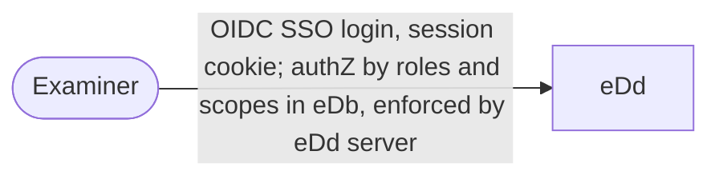

## dApp → aAPI

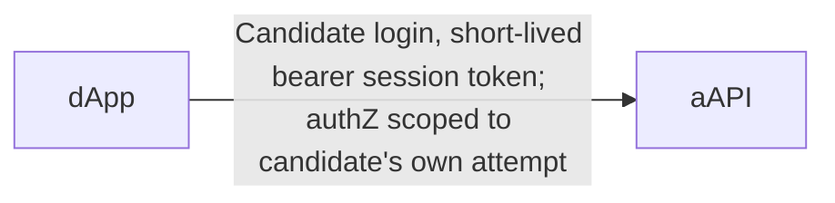

## wApp → aAPI

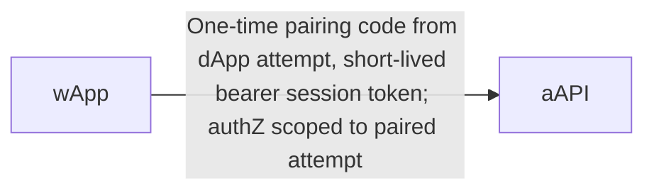

## aAPI → cAPI

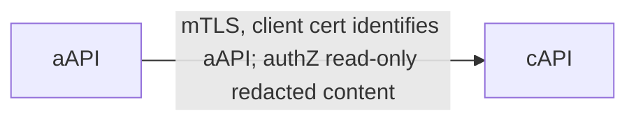

## eDd → cAPI

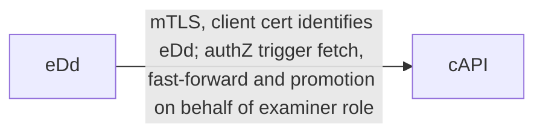

## aAPI → mDb

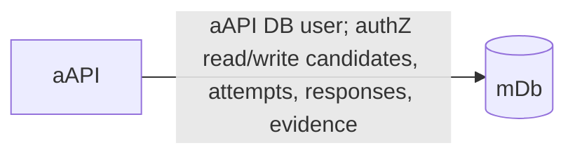

## eDd → mDb

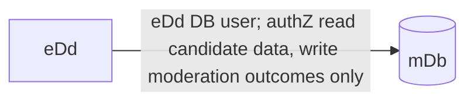

## eDd → eDb

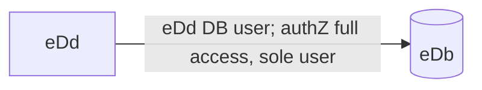

## eDd → Authoring clone

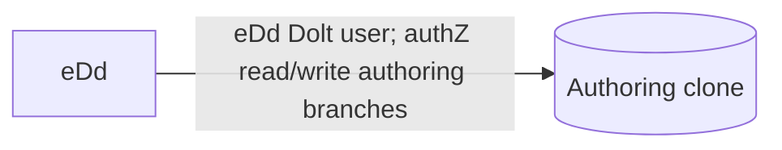

## cAPI → cDb

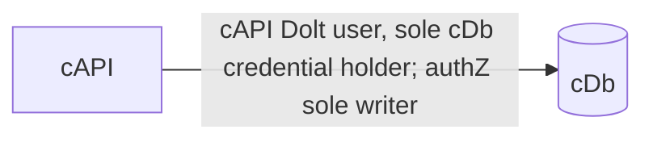

## cDb → Authoring clone (fetch, driven by cAPI)

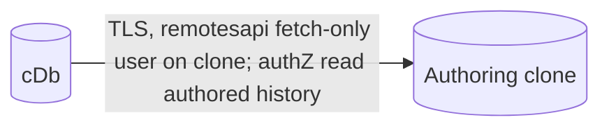

## Authoring clone → cDb (clone and schema pull)

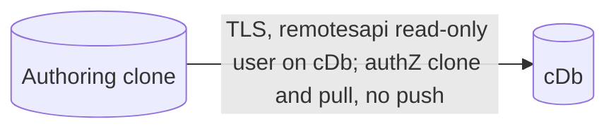
